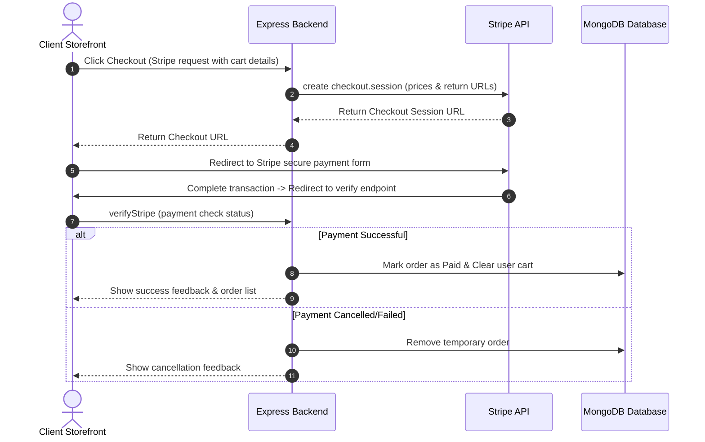

# <p align="center">🛍️ Deal-O-City 🛍️</p>

<p align="center">
  <strong>A Premium, Full-Stack MERN E-Commerce Ecosystem with Stripe & Cloudinary</strong>
</p>

<p align="center">
  
  
  
  
  
  
  
  
  
</p>

---

## 🌟 Overview

**Deal-O-City** is a premium, interactive full-stack e-commerce marketplace. Built using the **MERN** stack, it delivers an ultra-smooth storefront for users and a comprehensive dashboard for administrators. Product assets are served via **Cloudinary**, and transactions are secured by **Stripe Checkout**.

> 💡 **Key Highlight:** Designed with standard-based API routes, modular folders, and independent configurations for easy local development or seamless cloud deployment on Vercel.

---

## 🚀 Interactive Features Showcase

<table>
<tr>
<td width="50%" valign="top">

### 🛒 Client Storefront
*   ✨ **Fluid Catalog:** Grid view with instant categorization, sorting, and responsive multi-field searching.
*   📦 **Dynamic Cart:** Real-time quantity adjustments, price calculations, and subtotaling.
*   🔒 **Secure Auth:** JWT-based user login & signup with client-side token verification.
*   💳 **Checkout Gateways:**
    *   *Stripe:* Secure credit card processing with order verification hooks.
    *   *Cash on Delivery (COD):* Fast, config-free checkout.
*   📈 **Order Tracker:** Live user-facing delivery progression and purchase records.

</td>
<td width="50%" valign="top">

### 💼 Admin Dashboard
*   ➕ **Create Products:** Upload multiple images to Cloudinary, specify names, sizes, price, categories, and bestseller tags.
*   📝 **Modify Items:** Easily change pricing, description, inventory parameters, or remove products entirely.
*   📊 **Order Monitor:** Complete overview of all client transactions, status updates (Pending, Shipped, Delivered), and billing options.
*   🛡️ **Admin Auth:** Secure administrative credential matching to protect panel operations.

</td>
</tr>
</table>

---

## 📁 Repository Map

```
Deal-O-City/
├── 💼 Admin/              # Admin dashboard React app (Vite)
├── ⚙️ Backend/            # Express Node API server (Mongoose ORM)
├── 🎨 Frontend/           # Customer e-commerce store React app (Vite)
├── 📄 data.js             # Local seed/demo database records
├── ⚙️ package.json        # Project metadata
└── 📘 README.md           # Documentation (You are here!)
```

---

## 🛠️ Step-by-Step Installation Guide

<details>
<summary>📋 <strong>Step 1: Prerequisites & Repository Cloning</strong> (Click to Expand)</summary>

Ensure you have **Node.js** (v18+) and **MongoDB** installed locally or access to a **MongoDB Atlas Cloud** cluster.

Clone the project folder and navigate to the project directory:
```bash
git clone <repository-url>
cd Deal-O-City
```
</details>

<details>
<summary>⚙️ <strong>Step 2: Backend API Setup</strong> (Click to Expand)</summary>

1. Navigate to the server folder:
   ```bash
   cd Backend
   ```
2. Install npm modules:
   ```bash
   npm install
   ```
3. Initialize environment file:
   ```bash
   cp .env.example .env
   ```
   *Open `.env` and enter your keys (see the keys dictionary below).*
4. Fire up the backend:
   ```bash
   # Running with nodemon hot-reload (Recommended for Dev)
   npm run server

   # Or standard launch:
   npm start
   ```
   *API will run on **`http://localhost:4000`***.
</details>

<details>
<summary>💼 <strong>Step 3: Admin Dashboard Setup</strong> (Click to Expand)</summary>

1. Open a new terminal and navigate to the Admin directory:
   ```bash
   cd Admin
   ```
2. Install dependencies:
   ```bash
   npm install
   ```
3. Configure the environment variables:
   ```bash
   cp .env.example .env
   ```
   *Make sure `VITE_BACKEND_URL` matches your running backend URI (default: `http://localhost:4000`).*
4. Run the development server:
   ```bash
   npm run dev
   ```
   *Admin Panel is available at **`http://localhost:5174`***.
</details>

<details>
<summary>🎨 <strong>Step 4: Customer Frontend Setup</strong> (Click to Expand)</summary>

1. Open a new terminal and navigate to the Frontend directory:
   ```bash
   cd Frontend
   ```
2. Install dependencies:
   ```bash
   npm install
   ```
3. Configure the environment variables:
   ```bash
   cp .env.example .env
   ```
   *Make sure `VITE_BACKEND_URL` matches your running backend URI (default: `http://localhost:4000`).*
4. Run the development server:
   ```bash
   npm run dev
   ```
   *Customer Storefront is available at **`http://localhost:5173`***.
</details>

---

## 🔑 Environment Keys Dictionary

Create a `.env` in the respective folders and reference this mapping:

### ⚙️ Backend Environment Keys (`Backend/.env`)
| Variable | Description | Source |
| :--- | :--- | :--- |
| `PORT` | Local host port configuration (e.g., `4000`). | Custom |
| `MONGODB_URI` | Database connection string. | [MongoDB Atlas](https://www.mongodb.com/cloud/atlas) or local mongo db server. |
| `CLOUDINARY_NAME` | Cloud storage namespace. | [Cloudinary Dashboard](https://cloudinary.com/) Account Details. |
| `CLOUDINARY_API_KEY` | Public key for CDN storage upload. | [Cloudinary Dashboard](https://cloudinary.com/) Account Details. |
| `CLOUDINARY_API_SECRET` | Private key for CDN storage upload. | [Cloudinary Dashboard](https://cloudinary.com/) Account Details. |
| `JWT_SECRET` | Signature token encryption string. | Custom (e.g., randomized hash sequence). |
| `ADMIN_EMAIL` | Credentials for Dashboard authentication. | Custom (e.g., `admin@dealocity.com`). |
| `ADMIN_PASSWORD` | Password for Dashboard authentication. | Custom. |
| `STRIPE_SECRET_KEY` | Payment API verification credential. | [Stripe Dashboard Developer Console](https://stripe.com/). |

### 🎨 Frontend & Admin Dashboard Keys (`Frontend/.env` & `Admin/.env`)
| Variable | Description | Value |
| :--- | :--- | :--- |
| `VITE_BACKEND_URL` | Backend server URL endpoint for APIs. | `http://localhost:4000` |

---

## 💳 Payment Integrations Workflow



---

## 🚀 Vercel Deployments
Each folder is pre-packaged with a `vercel.json` config.
*   **Static client files (Frontend/Admin):** SPA rewrite rules maps any virtual routes back to `/index.html` seamlessly.
*   **Backend functions (Express):** Deploys Express endpoints serverlessly.
